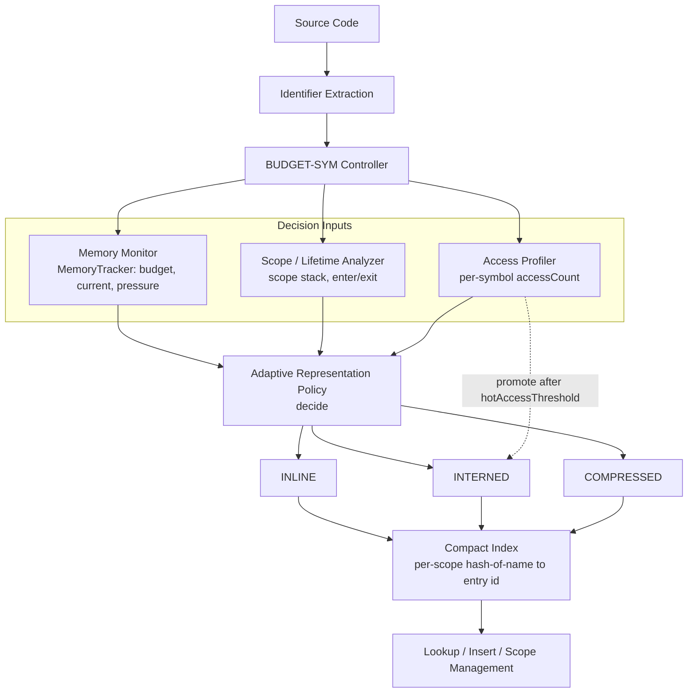

# Architecture

## Data flow

## Component map (file -> responsibility)

| Component | File | Responsibility |
|---|---|---|
| Shared types | `include/common.hpp` | `Representation` enum, `PolicyConfig`, `SymbolMeta`, FNV-1a hash |
| Memory Monitor | `include/memory_tracker.hpp` | Tracked-memory accounting, budget, pressure |
| Conventional baseline | `include/conventional_symbol_table.hpp` | Baseline #1: `unordered_map<string, Symbol>` per scope |
| Interned baseline | `include/interned_symbol_table.hpp` | Baseline #2: refcounted shared string pool, poolIndex-keyed scopes |
| BUDGET-SYM controller | `include/budget_sym.hpp` | `decide()` policy, three representations, promotion, scope reclamation |
| High-res timer | `include/hires_timer.hpp` | Working wall-clock timing (see `docs/methodology.md` for why this exists) |
| CLI demo | `src/demo_main.cpp` -> `budget_sym_demo` | Human-readable walkthrough of every mechanism |
| Benchmark | `src/benchmark_main.cpp` -> `benchmark` | 8-dataset measured comparison -> `results/benchmark_results.csv` |
| Ablation | `src/ablation_main.cpp` -> `ablation` | 4-variant mechanism isolation -> `results/ablation_results.csv` |
| Plotting | `scripts/plot_results.py` | Reads the CSVs above, writes `figures/*.png` |
| Correctness | `tests/smoke_test.cpp` -> `smoke_test` | Assert-based checks, no fabricated pass |

## Why the lookup index cannot be keyed by the identifier string itself

This is the one design decision worth calling out explicitly, because it is
the reason BUDGET-SYM's code looks meaningfully different from the two
baselines, not just "the same map with extra branches."

If `BudgetSym`'s per-scope lookup structure were `unordered_map<std::string,
Entry>` (like `ConventionalSymbolTable`'s), the map key itself would be a full
copy of the identifier -- **regardless of which representation the entry
claims to use.** A "COMPRESSED" entry stored that way would still cost a full
string in the map key, making the compression accounting fictional.

So each scope instead maps `fnv1a(name) -> entry id` (an
`unordered_multimap<uint64_t, int>`), and `entries_` holds the actual
per-symbol data (`inlineStr`, or `poolIndex` into the shared pool, or
`compIndex` into the front-coded chain). `lookup(name)` hashes the query,
walks the (usually tiny) bucket of same-hash candidates, and reconstructs
each candidate's real identifier from its representation to confirm an exact
match. This is also the direct, mechanical cause of COMPRESSED's higher
lookup cost relative to INLINE/INTERNED -- see
`docs/faculty_questions.md`, "Does compression hurt lookup?".
